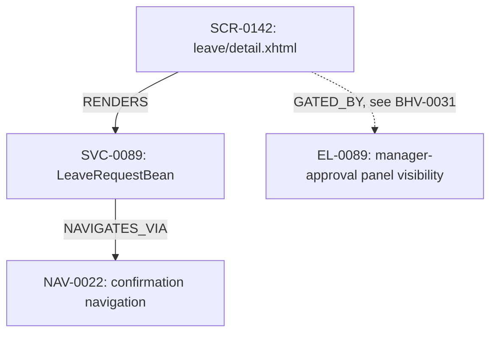

<!--
  scenario_density/density_band_status are null, not the last-computed
  0.5/in-band: status is coverage-triaged, meaning c4 has produced measured
  coverage for this behavior, so the density ratio has expired per
  docs/metrics.md #1 and is no longer computed or acted on (D5, REVIEW.md —
  this example previously kept density_band_status: in-band live alongside
  coverage-triaged, which the framework's own expiry rule forbids).
-->

## Neighborhood diagram

## Description

A user viewing the leave request detail screen enters a start date, an end
date, and optionally marks the request as half-day, then submits. Depending
on whether the dates are valid, the request is either saved with status
`PENDING_MANAGER_APPROVAL` and the user is taken to a confirmation screen,
or a validation error is shown and nothing is saved.

## Scope note

This behavior covers the screen, its backing bean, and its outgoing
navigation only. The condition governing whether the manager-approval panel
is visible on this same screen is reused elsewhere in the application (it
originates from a lifted EL expression, `EL-0089`) and is specified
separately as `BHV-0031` ("Manager approval panel visibility"), linked here
via `related_behaviors` rather than absorbed into this behavior's scope.

## Scenarios

| scenario_id | Given | When | Then | legacy_refs | origin | decision_table_ref |
|---|---|---|---|---|---|---|
| BHV-0142-S01 | startDate is before endDate | the user submits the leave request form | the request is saved with status PENDING_MANAGER_APPROVAL and the user is navigated to the confirmation screen | `LeaveRequestBean.java:40-52` | legacy | |
| BHV-0142-S02 | startDate is after or equal to endDate | the user submits the leave request form | a validation error "Start date must be before end date" is shown and the request is not saved | `LeaveRequestBean.java:40-52` | legacy | DT-BHV-0142-01 |
| BHV-0142-S03 | startDate equals endDate and the half-day flag is not set | the user submits the leave request form | a validation error about the half-day flag is shown and the request is not saved | `LeaveRequestBean.java:47` | legacy | |

`BHV-0142-S03` was not present in the initial draft (`b4`) or in `c1`'s
first AC pass — it was added after `c5`'s coverage triage flagged
`LeaveRequestBean.java:47` as a `missing_scenario` (see
`triage-log-excerpt.jsonl` in this directory). This is the intended loop:
the coverage oracle finding a gap is what completed this behavior's spec,
not a second, more careful read of the code.

## Decision tables

### DT-BHV-0142-01 — start/end date ordering check

Backs scenario `BHV-0142-S02`. Source condition:
`startDate.isAfter(endDate) || startDate.isEqual(endDate)`
(`LeaveRequestBean.java:41`). Two sub-conditions, MC/DC requires at least 3
rows — no configuration dimension here, so nothing in this table is
eligible for pairwise reduction (`c2b` was not run against it).

| row_id | start_after_end | start_equal_end | expected_outcome | legacy_refs |
|---|---|---|---|---|
| R1 | true | false | validation error shown, not saved | `LeaveRequestBean.java:41-44` |
| R2 | false | true | validation error shown, not saved | `LeaveRequestBean.java:41-44` |
| R3 | false | false | request proceeds to save | `LeaveRequestBean.java:41-52` |

## Coverage triage (summary)

Two branches were reported uncovered by `c4` against the initial
`BHV-0142-S01`/`S02` scenarios and DT-BHV-0142-01. Both are resolved — see
`triage-log-excerpt.jsonl`:

- `LeaveRequestBean.java:47` → `missing_scenario` → resolved by adding
  `BHV-0142-S03` above.
- `LeaveRequestBean.java:210` → `unreachable_defensive`, accepted with
  justification (a DB-enforced status-enum invariant) — no scenario added.

This behavior's `risk_tier` is `sampled` (taxonomy `screen`, no
`high_risk_override`), but both of its uncovered branches happened to fall
inside this application's sample — at this branch count there's no
`not_sampled` entry to show. See `docs/metrics.md` #3 for how the sampling
rate is chosen and recorded at application scale.
