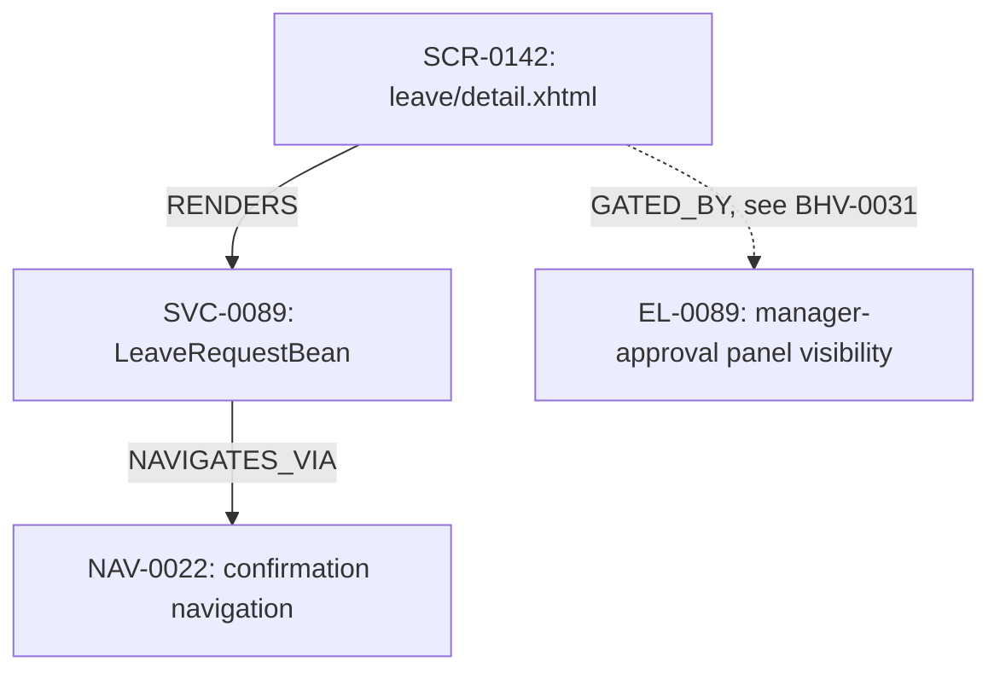
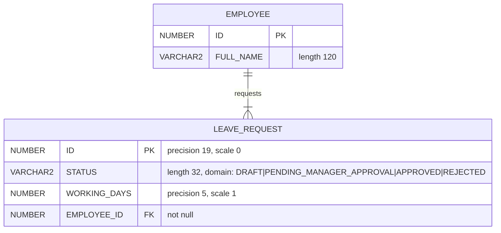
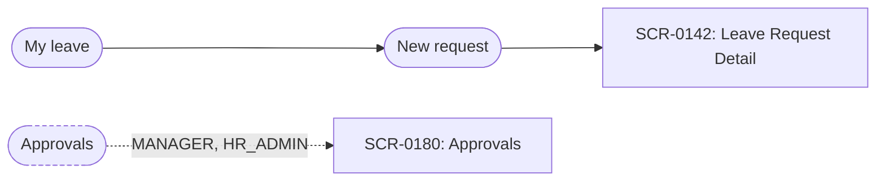
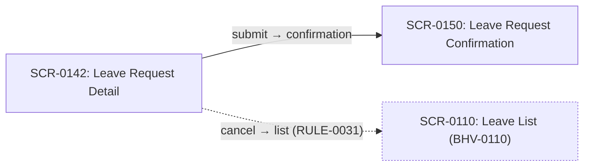
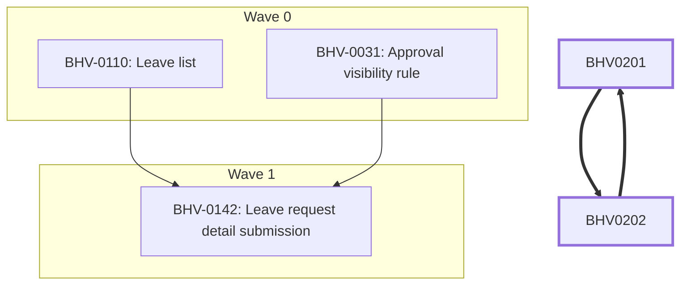

# Renderer: pack facts -> Mermaid

Four diagram families, one contract. Consumed by
`steps/b3-draft-behavior-boundary.yaml` (neighborhood) and
`steps/c9-assemble-spec-pack.yaml` (the other three).

They share their id sanitisation, escaping, ordering, provenance and capping
rules, and those rules are the bulk of the specification — three separate
renderer files would triplicate them, which is the mistake `a3`/`a6`/`a7` made
(`DECISIONS.md`, "The three lifts are one step").

Every diagram here is a **projection**. It holds no fact its source doesn't,
regenerates byte-identically, and is never hand-edited. Anything true in a
diagram and absent from `nodes.jsonl` / `schema.json` / `order.json` is a
renderer bug.

---

## Shared rules

**Node ids.** A Mermaid identifier cannot contain `-`, so an inventory id is
sanitised by removing it: `SCR-0142` → `SCR0142`. The original id always
appears in the *label*, so the sanitisation is never lossy to a reader. Never
renumber, never abbreviate, never invent a short form.

**Labels.** Always quoted — `SCR0142["SCR-0142: Leave Request Detail"]` — since
an unquoted label breaks on `:`, `(`, `,` and `#`, all of which appear in real
labels. Inside a quoted label, escape `"` as `#quot;` and strip newlines.
Truncate to 60 characters with a trailing `…`; the full text is in the pack.

**Ordering.** Nodes sorted by id, edges sorted by `(from, to, type)`. Never
insertion order, never hash order — a diagram whose lines move between runs
cannot be diffed, which is half of what a projection is for.

**Provenance.** Every diagram opens with one comment line naming what it was
generated from, so a reader who finds it surprising knows what to go and read:

```
%% generated from data/schema.json by templates/renderers/mermaid.md — do not edit
```

**Capping is stated, never silent.** Each family below declares a node cap and
what happens above it. When a cap truncates, the diagram carries a visible note
node and the manifest records the omission. A diagram that silently dropped
half the graph is worse than no diagram: it reads as complete.

```
_note["⚠ 62 of 148 tables shown — split by FK component, see data/erd-*.mmd"]
```

**No styling beyond semantics.** Colour and `classDef` are used only where they
carry meaning defined here (a cycle, a capped note, a guarded edge). A diagram
styled for looks stops being regenerable the first time someone tweaks it.

---

## 1. Neighborhood — per behavior

**Source:** the `neighborhood_nodes` / `neighborhood_edges` given to `b3`.
**Output:** the `neighborhood_diagram` field of `BHV-####.md`, rendered inline
under `## Neighborhood diagram`.
**Cap:** 2 hops from the seed node, already enforced upstream for `b3`'s input
bounding — which happens to be exactly where a diagram stays legible.

This existed before this contract did and was specified only as prose in
`docs/phase-b-behaviors.md`. It is the same mapping, now written down.



Edge style: solid for a structural edge, **dotted for a `GUARDS` edge** — a
guard is a condition rather than a call, and drawing both the same way is what
makes a reader think an EL expression is invoked. A node owned by a different
behavior carries `see BHV-####` in its edge label.

**There is no whole-inventory diagram, in this family or any other.** At
thousands of nodes it is illegible and past Mermaid's practical rendering size;
a whole-graph question is a query against `graph_store`. See `DECISIONS.md`.

---

## 2. ERD — the data model

**Source:** `data/schema.json`.
**Output:** `data/erd.mmd`.
**Cap:** 40 tables. Above it, split by FK-connected component into
`data/erd-<n>.mmd` (components ordered by size, then by lowest table name), and
emit `data/erd.mmd` holding only the note node and the index of the parts.

Unlike the inventory graph this one is legible whole in the common case — a
legacy schema is tens of tables, not thousands — which is why it gets a
whole-system diagram where the graph does not.



**Attribute lines.** `<type> <name> [PK|FK|UK] "<comment>"`. The type is the
catalog's base type name only — no parenthesised precision, which older Mermaid
parsers reject. The value facts go in the comment, in this fixed order and
omitting what is null: `precision N`, `scale N`, `length N`, `not null`,
`default <v>`, `domain: a|b|c`. Truncate the comment at 80 characters.

Putting precision and scale here is deliberate: they are the value facts an
implementer cannot recover from behavior (`docs/phase-a-inventory.md`, "Value
facts"), and an ERD that shows only names and types is the diagram that lets
an ORM's silent default through.

**Cardinality is derived, never guessed.** From the child's FK column:

| FK column | Rendered |
|---|---|
| `nullable: false` | `PARENT \|\|--\|{ CHILD` — one to one-or-more |
| `nullable: true` | `PARENT \|\|--o{ CHILD` — one to zero-or-more |

The relationship label is the FK constraint name where the catalog has one,
otherwise the child column name minus a trailing `_ID`. Never a phrase invented
to read well.

**Triggers and stored procedures are not drawn.** They are not entities, and
their *logic* is a lifted `RULE` living in whichever behavior covers it. A
table carrying a trigger gets one comment line on the table — `%% trigger:
trg_leave_request_audit (RULE-0060)` — so the fact is visible without
pretending a trigger is a box in an ERD.

---

## 3. Screen flow — how a user moves through the application

Two diagrams, because the question has a global and a local form.

### 3a. `views/menu.mmd` — the shell

**Source:** `TPL.nav_menu` (every `TPL` that renders one).
**Cap:** none needed — a menu is a tree an application's own designers kept
navigable, so it is legible by construction. If one exceeds 80 nodes, cap and
note it.



Menu items are stadium-shaped (`([...])`) and screens rectangular, so the
diagram distinguishes a navigation affordance from a destination. A menu item
with `roles_visible_to` or a `render_guard` gets a **dotted edge labelled with
the roles**, and the `guarded` class — this is the only diagram in the pack
that shows who can reach what, and `auth/constraints.json` says it in text.

A menu item whose `target_screen` is `null` (the target view resolved to no
`SCR` node) renders as a node labelled `unresolved: <target_view>`. It is a
finding, not something to omit.

### 3b. `behaviors/BHV-####/flow.mmd` — per behavior

**Source:** the behavior's covered `SCR` and `NAV` nodes, plus `NAVIGATES_TO`
edges, plus one hop out to screens it navigates to that it does not cover.
**Cap:** the behavior's covered screens plus one hop, hard. A behavior large
enough to exceed that fails `sizing_thresholds` first.

Per-behavior scoping is not a nicety. A 200-screen application's whole flow
graph is a hairball that answers nothing, which is the same argument that
denies the inventory graph a diagram. Bounding it by `COVERS` gives a diagram
whose size is bounded by the behavior sizing rules already in force.



Edge label is `<from_outcome> → <to_view basename>`. A `NAV` node with a
non-null `condition` renders dotted with the lifted `RULE` id appended — the
same convention as the neighborhood diagram, for the same reason: a conditional
transition must not look unconditional. A one-hop-out screen carries its owning
`BHV` in the label and the `external` class.

---

## 4. Build order — what can be built in parallel, and where the cycles are

**Source:** `behaviors/order.json`.
**Output:** `behaviors/order.mmd`.
**Cap:** 60 behaviors. Above it, emit one file per wave
(`behaviors/order-wave-<n>.mmd`) plus `behaviors/order.mmd` holding
wave-to-wave dependencies at the wave level only, with the note node.



One `subgraph` per wave, in wave order, with behaviors inside sorted by
`dependents_count` descending then id — which is the order `order.json` already
says to work them in *within* a wave, so the diagram reads top-to-bottom as the
build sequence.

**Cycle members use a thick edge (`==>`) and the `cycle` class.** This is the
diagram's main reason to exist. `order.json` reports cycles and deliberately
never breaks them — choosing where to cut one is a human decision the framework
has no business making — and a cycle is very hard to see in JSON and immediate
in a picture. Every member of a `cycle_group` is drawn in the wave of the
condensed group, since that is where the ordering places it.

---

## Where they appear in the pack

The `.mmd` files are the projections. The pack's generated `README.md`
additionally **inlines the ERD only**, in a mermaid fence, because it is the
`generated_index` and a reader should see the shape of the data before reading
anything else. The other three are linked, not inlined: an index carrying four
large diagrams stops being an index, and the ERD is the one that is both
whole-system and bounded by nature.

Inlining a projection inside another generated file is not a second source —
both regenerate from `schema.json`, and `projection_regenerates_identically`
checks both.

## Idempotence requirement

Re-rendering unchanged sources must produce byte-identical files: sorted nodes
and edges as above, no timestamps, no absolute paths, no run ids, and
integer-only arithmetic anywhere a count or a cap is computed.

## What these diagrams are not

They are not a substitute for the files they project. `data/schema.json` is
what an implementer builds entities from; the ERD is what a reviewer looks at
first. Where the two disagree the JSON is right and the renderer has a bug.
